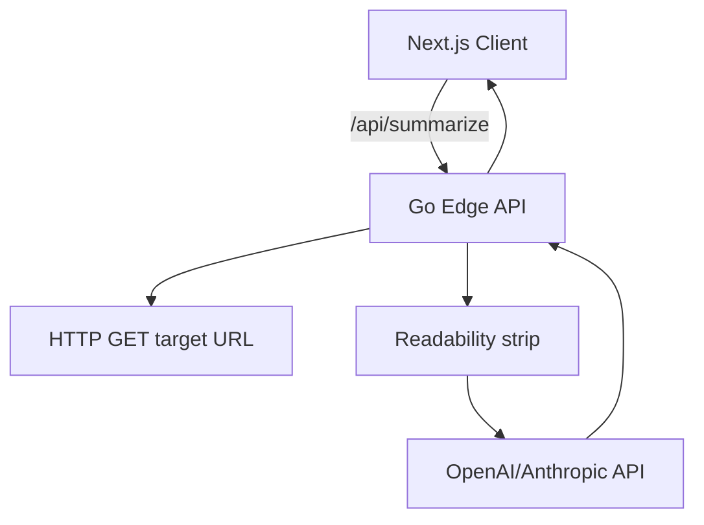

**Project Pick → “TL;DR-as-a-Service”**

A razor-thin web app that takes any public URL, auto-grabs the article, and returns a concise, headline-style TL;DR generated by OpenAI or Anthropic. One screen, one button, one API route. Perfect for showing:

* a Go backend (web scraping + LLM call)  
* a Next.js frontend (fetch → render summary)  
* real-world deployment on Fly.io (single command)

---

## PRD — TL;DR-as-a-Service

| Section | Details |
|---------|---------|
| **Goal** | Ship a public demo that transforms long articles into crisp summaries (“tweetable” < 280 chars) in < 5 seconds. |
| **Persona** | Busy dev scanning tech news; recruiter skimming candidate blog posts; student prepping for class. |
| **Core Use-case** | Paste URL → click **Summarize** → receive headline + bullet TL;DR. |
| **Non-Goals** | Auth, rate-limiting, storage, mobile app, billing. |
| **Success Metrics** | • 100% summaries < 280 chars<br>• P95 latency < 5 s round-trip<br>• Deployed & shareable on the open web. |

### Functional Requirements

1. **Input Validation**  
   * Accept https URLs only.  
   * Reject (>20 kB) HTML to avoid huge token cost.

2. **Article Extraction**  
   * Fetch page server-side in Go.  
   * Strip boilerplate (Readability or go-readability).  
   * Return cleaned text (max 8 kB) for LLM.

3. **LLM Summarization**  
   * System prompt: *“You are a master headline writer. Provide a one-sentence headline and 3 bullet takeaway points, total < 280 chars.”*  
   * Use `gpt-3.5-turbo` (fallback: Anthropic Claude-Haiku).  
   * Temperature 0.5.

4. **Response Payload**  
   ```json
   {
     "headline": "string",
     "bullets": ["...", "...", "..."]
   }
   ```

5. **Frontend UX (Next.js / React-18)**  
   * Single Hero section → URL input + CTA.  
   * Loading spinner (skeleton).  
   * Render result with copy-to-clipboard.  
   * Toast on error (“Couldn’t fetch that page”)—no modal spam.

6. **Deployment**  
   * Fly.io multi-region (fra + ord) for low latency.  
   * `fly launch` for Go API, `fly launch --name tldr-ui` for static Next.js (or colocate via reverse proxy).  

### Technical Architecture



| Component | Stack / Libs |
|-----------|--------------|
| **Frontend** | Next.js 14 (App Router), SWR, Tailwind, TypeScript |
| **Backend** | Go 1.24, Fiber (minimal router), go-readability, `openai-go` |
| **Infra** | Fly.io, Dockerfile (multi-stage) |

### API Contract

*`POST /api/summarize`*

| Field | Type | Notes |
|-------|------|-------|
| `url` | string | Required, public HTTP/HTTPS. |

**200 OK**

```json
{ "headline": "Rust 2.0 Released", "bullets": ["Async GC built-in", "Rustfmt autogen docs", "Crates upgrade tool"] }
```

**400** – invalid URL  
**422** – extraction failed  
**500** – LLM or upstream error

### Development Plan (Windurf/Cursor-first)

| Day | Task | Tooling Hack |
|-----|------|--------------|
| 0 | Repo scaffold (monorepo) | `windurf init` |
| 0 | Dockerfile + Fly apps | `fly launch --no-deploy` |
| 1 | Go endpoint w/ dummy JSON | Cursor AI “write handler” |
| 1 | Readability extraction | Cursor refactor |
| 2 | LLM call + env var secrets | `.env`, Fly secrets |
| 2 | Next.js page, fetcher | Cursor auto-gen hooks |
| 2 | Styling + skeleton loading | Tailwind presets |
| 3 | End-to-end test, vercel-style preview | Playwright (optional) |
| 3 | Deploy prod, share link | `fly deploy` |

